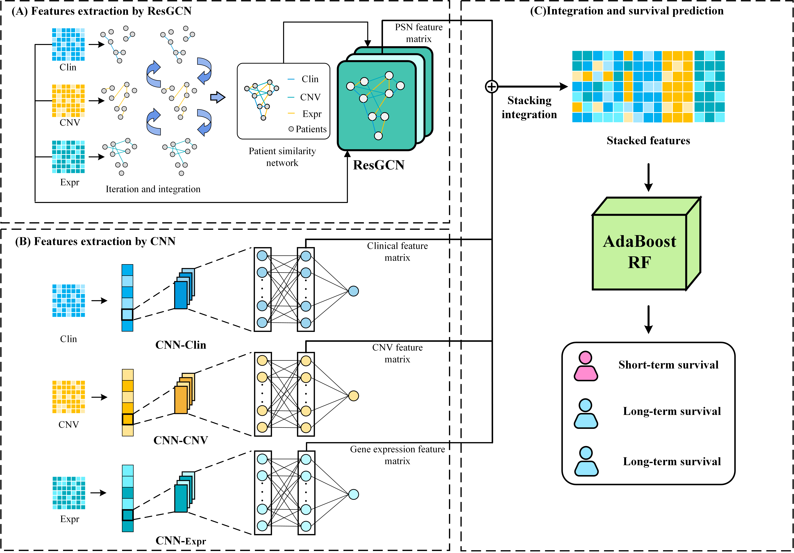

# MSFN
MSFN: A Multi-omics Stacked Fusion Network for Breast Survival Prediction

### The architecture of MSFN:

Requirements
========================
    [python 3.7]
    [PyTorch 1.10.0]
    [numpy 1.21.6]
    [pandas 1.1.5]
    [scikit-learn 1.0.2]
    [torchaudio 0.10.0]
    [torchtuples 0.2.2]
    [torchvision 0.11.0]

    [scikit-learn 0.18]
Usage
========================
1.Run ResGCN/SNF.py to generate the patient similarity network,run ResGCN/TRAIN.py to train ResGCN and extract hidden layer feature representations.
2.Run CNN/clin.py,CNN/CNV.py,CNN/mRNA.py to train CNNs and extract hidden layer feature representations.
3.Run AdaBoostRF.py for survival prediction.
